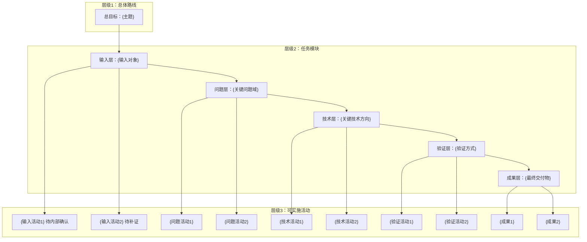

# Technical Route Diagram

Use this reference when a proposal, implementation plan, feasibility report, or review draft needs a technical route diagram (技术路线图), technology roadmap, implementation flow, or Mermaid flowchart.

## Progressive Method

1. Bound the topic: restate the project topic, document audience, and evidence boundary.
2. Extract the implementation logic from the evidence map:
   - 3 key problems the project must solve (from `06_evidence_map.json` `key_problems[]`).
   - 3 key technologies or methods the project will develop (from `key_technologies[]`).
   - Main data/material inputs, validation/demonstration outputs.
3. Build a maximum 3-level structure:
   - L1: project overall objective.
   - L2: task modules — 输入层 → 问题层 → 技术层 → 验证层 → 成果层.
   - L3: implementable activities, methods, or outputs.
4. Connect modules by actual dependencies: input → problem → technology → validation → deliverable.
5. Evidence gaps in L3 nodes: use `待补证`, `待验证`, or `待内部确认`.
6. Add a post-diagram explanation mapping each layer to evidence sources and gaps.
7. Keep node labels short and implementable. No citation IDs inside nodes.

## Mermaid Pattern (V2)



## Post-Diagram Explanation Format

After the Mermaid block, include:

```
> **图后说明**：
> - 证据支撑：C1-C2 基于 [Sx][Sy]；D1-D2 基于 [Sz][Sw]
> - 待补证节点（B1/B2）对应证据缺口 [G1][G5]
> - 3 个关键问题与 3 个关键技术对应第 5 章论述
```

## Quality Gate

Before finalizing:
- Exactly 3 key problems and exactly 3 key technologies (when user requests `[3]`)
- No more than 3 structural levels
- Every module has a clear dependency, input, output, or validation route
- Node labels are implementable actions or deliverables, not vague slogans
- Evidence gaps remain visible (annotated in nodes, not hidden)
- Mermaid syntax is fenced as ` ```mermaid `
- Post-diagram explanation maps each layer to source IDs and gap IDs

## Integration with Document Body

### Terminology Lock
Route diagram node labels must match section/subsection headings in the body. If the route says `"多参数NDE测量"`, the body must use that exact phrase as a heading.

### Count Lock
Exactly N key problems and M key technologies in the route = exactly N+M in body section 5 (关键技术问题与解决方案). Supplementary issues go into risk table or auxiliary problem table.

### Layer-Section Mapping

| Route Layer | Body Section |
|-------------|-------------|
| 总目标 (L1) | Title / Abstract |
| 输入/背景层 (L2) | §1 背景与意义, 研究基础章节 |
| 问题/缺口层 (L2) | §1 现有方法局限, §2 国内差距 |
| 方法/技术层 (L2) | §3 研究目标, §4 技术路线与方法 |
| 验证层 (L2) | 实验/案例验证章节（与主题相关） |
| 成果层 (L2) | 预期成果章节 |

> 具体章节名由 Stage 0 选定的模板决定，上表为 proposal 模板的默认映射。

### Gap Visibility
Any route L3 node marked `待补证` / `待验证` / `待内部确认` must appear as an evidence gap entry in the corresponding body section AND in the internal materials request list (if `待内部确认`).

### Citation Locality
Source citation IDs `[Sx]` belong in body prose near the route node's corresponding section, NOT inside route node labels. Post-diagram explanation carries the source/gap mapping.

### Generation Order
1. Evidence map (with route-aware section mapping, key_problems, key_technologies)
2. Route diagram (derived from evidence map)
3. Draft body (constrained by route diagram)
4. Post-diagram explanation (citations and gap annotations)

Never generate the route diagram AFTER the body.
