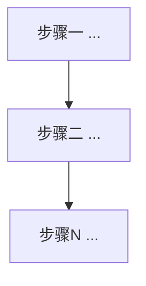

# {topic}——专利申请技术交底书

> **标记图例**：`[Sx]`=已审计来源（对应 `04_validated_sources.json` 的 source_id，**仅限背景技术节使用**，提交代理前由代理人剥离）；`[Gx]`=研究空白（附录A展开）；`[假设]`=未证实前提；`[待内部确认]`/`[待验证]`=待核验信息（实施例中用户未提供的试验数据一律标注，禁止虚构）。写法规范见 `references/patent_writing_guide.md`。

## 表单头
- 发明创造名称：{topic}
- 拟申请类型：☑发明专利 □实用新型（□国防专利）
- 申请人名称/地址：[待内部确认]
- 发明人：[待内部确认]
- 联系人/电话：[待内部确认]

## 一、技术领域
本发明属于{技术领域}技术领域，特别是涉及到一种{与名称一致的简称}。

## 二、背景技术
<!-- 三段式：对象重要性+失效后果（断言挂[Sx]）→ 现有技术分类与局限（指向同一瓶颈）→ 收敛句"现阶段的……均无法……，亟需……" -->

## 三、发明内容
### 1 目的
为了克服现有技术存在的不足：本发明提供一种{名称}，用于解决{与背景技术收敛句一致的技术瓶颈}。
### 2 技术方案
为了实现上述目的，本发明采用的技术方案是：一种{名称}，其特征在于：所述方法包括以下步骤，并按以下步骤顺次进行：
步骤一、{动词开头，关键参数给范围}；
步骤二、根据步骤一获得的……（显式依赖链）；……
（公式编号 (1)(2)…，公式后必须附"式中，X 为……"符号说明段）
### 3 效果
通过上述设计方案，本发明可以带来如下有益效果：{与技术方案逐项对应，机制性表述，禁营销副词}

## 四、附图说明
图1 {名称}的流程图
图2~图N {模型示意图/划分示意图/接线示意图/曲线}[待内部确认]

## 五、实施方式
<!-- 步骤重述（与技术方案逐字一致）→ 具体实施例（真实参数分步演示；验证数据=本发明计算结果 vs 独立手段实测对照，无数据标[待内部确认]）→ 兜底段（固定句式见指南2.6） -->

## 参考文献
## 附录A 证据缺口清单
